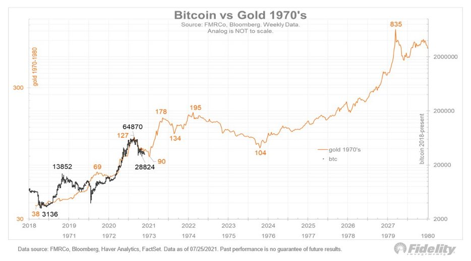
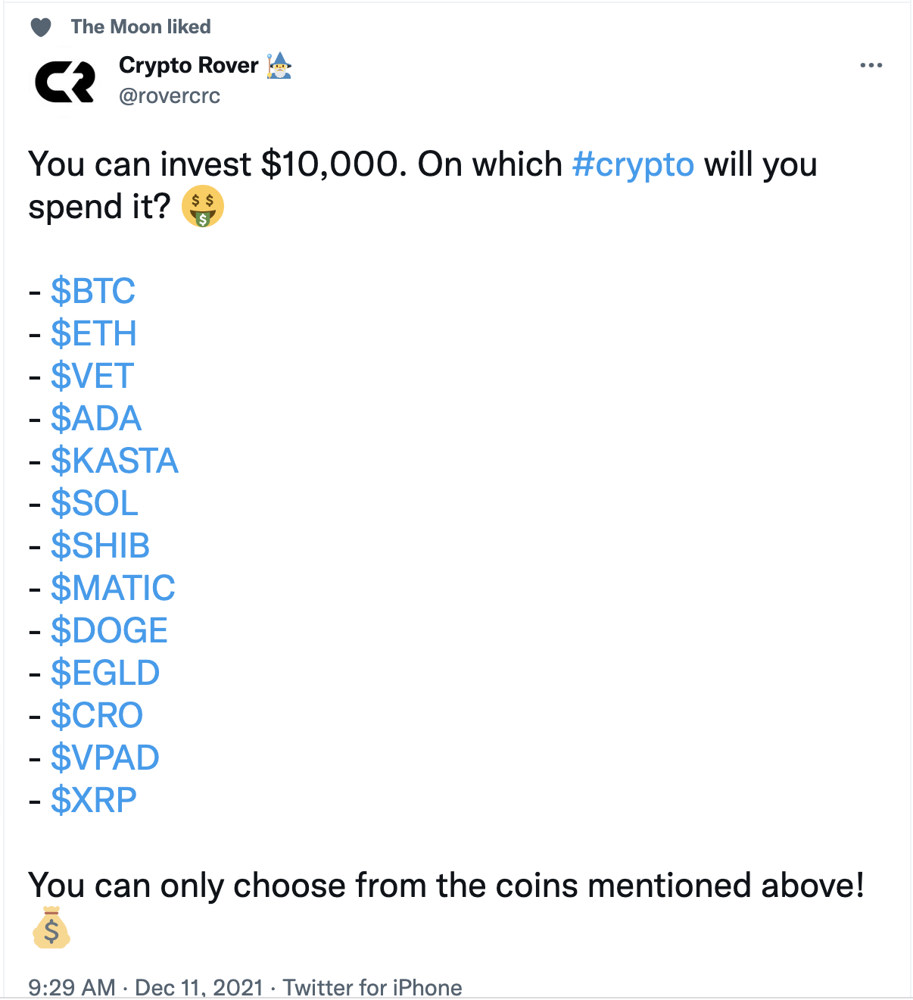

# Introduction
I've been always interested in cryptocurrency and have been wondering is it ever possible to know which altcoin is going to be the next hit. Bitcoin and Etherium has been promising this whole period and the size is already too huge to collapse (as I am aware). Also, I'm very much believing that Bitcoin is going to be the next steady financial asset just like gold.

However, I do not see why not we aren't investing on some small but potential coins like WEMIX and SAND. It would be dumb to invest all your bullets into these, but these coins may become the game changer when you are investing in adequate amount. So, I would like to see if I can make a list of candidates that would leap in the short future.

# Planning
The main technique I'm going to interpret is **text mining** with Python. There are some numerous crypto influencers that ask questions such as below. 

So basically, I am going to scrape all the retweets and see if which coin is the most popular and compare it to the real data. However, there are few things to consider during the process.

1. Some user might be mentioning the same coin over and over.
2. Liked retweets could mean something more than none-liked retweets.
3. Top influencers might have some coins that they are trying to promote.
4. The frequency of mentions could be different throughout certain time.

I am going to adjust to these factors as I proceed.

