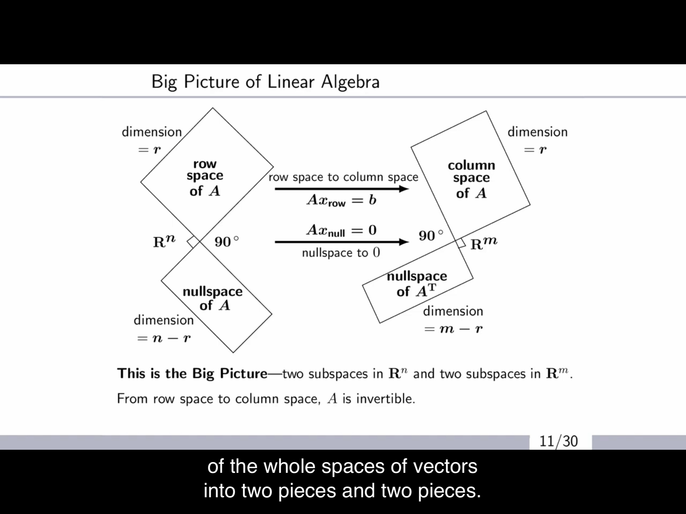

---
layout: post
title: 'Linear Algebra pt. 2'
usemathjax: true
---  
  
#  Introduction
  
The note is based on the lecture, [Matrix Methods in Data Analysis, Signal Processing and Machine Learning](https://www.youtube.com/watch?v=Cx5Z-OslNWE&list=PLUl4u3cNGP63oMNUHXqIUcrkS2PivhN3k ) taught by Gilbert Strang, M.I.T. The note is continued from the previous post about ['Linear Algebra pt. 1'](https://bbq12340.github.io/linearAlgebra1/)The class material is [here](https://math.mit.edu/~gs/learningfromdata/ ). This note is to get a more clear idea about linear algebra and its understanding.  

  
#  Matrix-vector multiplication using Column Space of A
  
###  Column Space
  
When we face  where  is non-zero, we've been calculating the multiplication by row times column; dot product. However, it seems very useful when we think vector-wise; column times row.  

  
  

  
  

  
  
When we think of all possible ,  

  
  
and let us denote this as,  

  
  
in this case, the column space of A would be a plane since the  which is a plane, a subspace of .  

Thus, **The combinations of columns fills out the column space.**
+ Why is this important?  
  
  When A is too big, and x=rand(m,1). We can sample 100 random x to have a broad idea about the columns of A.  

+ Is  columns of A?  
  yes. 
  
###  Rank Theorem; rank(col)=rank(row)
  
We can factor A easily by  

  
  
Since the dimension of column space of A and C is the same; rank = the number of independent columns,  

  
  
Thus, **The number of independent columns equals to the number of independent rows.**  

+ Why is this important?  
  
  When A is 50x100 matrix, we know that the number of independent columns are equal or lower than 50.
+ What is matrix R?  
  
  
  
###  Counting Theorem; dim(col sp.) + dim(null sp.) = # of cols
  
From above, we now know that  

  
  
let us not forget that A is m x n matrix and . Besides column space, there is null space; all independent solutions to . So, since there are  independent solutions in total,   

  
  
And since, null space is orthogonal to row space of A,  
  
We can then organize this thought just like below,  

  
  

Thus, these are called, **the 4 Fundamental Subspaces**.  

  
We can also expand this vector-wise i.e. outerproduct perspective to the next step.  

#  Matrix-Matrix Multiplication
  
###  Outer Product Approach
  

  
  
Don't forget that the rank of each of columns and rows is 1. So,  

  
  
I used blocks to express matrices just so to have a clearer picture. Coming back to the simple factorization using column space is also,  

  
  
So, unlike dot product (inner product) where we have to calculate the whole matrix, outer produc approach allows us to see the matrix in broad idea with less calculation. We will see how useful it is by looking over to the next key step.  

  
#  The Five Key Factorization
  
1. Elimination 
2. Gram-Schmidt 
3. Spectural Theorem 
4. 
5. SVD 
  
Calculation with matrices is a difficult job. Factorization makes it so much easier. All factorizations will be explained hopefully.  

  
###  Elimination
  

  
  
In outer product perspective the equation above would be,  

  
  
This would have a result like below,  

  
  
+ Why do we need this?  

  When we are able to factor a matrix into multiplication of triangular matrices, it makes our equation a lot more lighter such as for inversion and determinant.  

+ How to factorize?  
  
  Suppose there is 2 by 2 matrix, A that can be transformed into an upper triangular matrix U which will have 0 in (2,1). The process would look like this.  

  
  
###  Orthonormal & Eigenvalues & Eigenvectors
  
However, there is something further more special than LU decomposition (factorization). Elimination provides us more efficient way to calculate and observe a single matrix equation such as inverse or determinant. We need more than that.  

####  Orthonormal
  
Let us say there is an **orthogonal matrix** Q; square and orthonormal columns.  

  
  
This matrix is very special because  

1. length of linearly transformed vector is consistent  
   
   

  
  
2. inverse = transpose  
   
   

  
  
   don't forget that this doesn't apply to every **orthonormal matrices**, only **orthogonal matrices**.  

Since these matrices are very useful tools to manipulate equations, it would be very nice if we could make them and there are few representative methods. It would be wonderful to be able to explain all the methods, but most of them are very well explained in wikipedia. The main focus here is the last one; via eigenvectors.  

1. Rotation matrices  
   
   

  
  
2. Reflection matrices  
   
   

  
  
3. Householder reflection  
   
   

  
  
4. Hadamard  
   
   Always possible if = whole number 
   

  
  
5. Wavelets  
   
   Haar matrix by scaling  

   

  
  
6. **Eigenvectors**  
   
   We can create as many orthogonal matrices just like above, however, the most useful ones come from **the eigenvector matrices of symmatric / orthogonal matrices**.  

####  Eigenvalues & Eigenvectors
  
Let us say there is a **normal nxn matrix A** that have non-zero eigenvalues.  

  
  
This means that there are some vectors  with a constant direction after the linear mapping; . Such vectors of A is when dealing with equations like below.  

  
  
Then, let us say there is a **similar matrix B** that has same eigenvalues as A does.  

$$
B = M^{-1}AM
$$
  
This equation tells us that the similar matrix B has same eigenvalue but the eigenvector is different from A's; .  
Bonus: There are also some other ways to check when it comes to eigenvalues.  

$$
\begin{aligned}
   \Sigma\lambda &= tr(A) \\
   \Pi\lambda &= det(A)
\end{aligned}
$$
  
Let us say there is a **symmetric nxn matrix S** that have non-zero eigenvalues. Something we to remember is that the eigenvalues are real numbers and the eigenvectors are orthogonal.  

$$
\begin{aligned}
   S=\begin{bmatrix}
      0&1\\1&0
   \end{bmatrix}\\
   \ \\
   M^{-1}SM = \Lambda = \begin{bmatrix}
      1&0\\0&-1
   \end{bmatrix}\\
   \ \\
   SM = M\Lambda
\end{aligned}
$$
  
Implementing all we have learnt above in the current chapter, we are able to understand following; **S is similar to  and  is eigenvector matrix**. Now, with some further thinking, this does not only work in symmetric but also normal matrices. Thus, we can organize everything into two simple factorizations.  

$$
\begin{aligned}
   A &= X^{-1}\Lambda X \\
   S &= Q^{-1}\Lambda Q
\end{aligned}
$$
  
+ In conclusion?
  We can factor any matrices into composition of eigenvalues & eigenvectors. In addition, symmetric matrices provide us very useful orthogonal matrices.
  