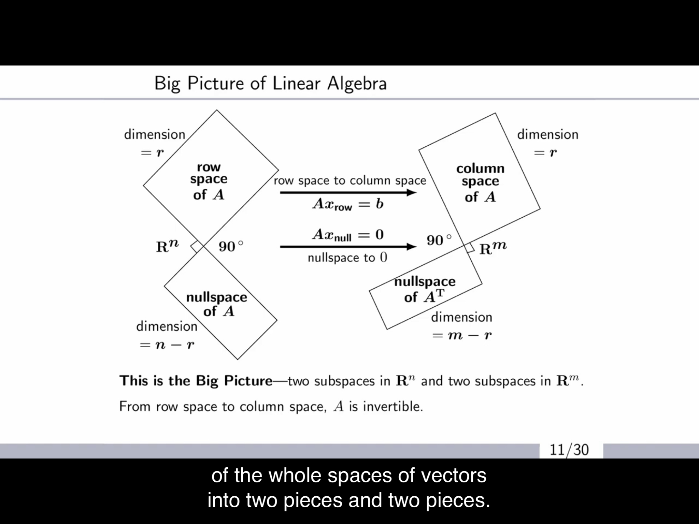

---
layout: post
title: 'Linear Algebra pt. 2'
usemathjax: true
---  
# Introduction
The note is based on a [MIT open course](https://www.youtube.com/playlist?list=PLE7DDD91010BC51F8) by professor Gilbert Strang. The post is continued from the [previous post](https://bbq12340.github.io/linearAlgebra1/)  

# Contents
1. Matrices
2. Spaces
3. Projections
4. Orthogonality
5. Eigenvalues & Eigenvectors  

# Projections

### Intro to Projections
  

As we know, there are times when $$Q\boldsymbol{x}=\boldsymbol{p}$$ have no solution because the matrix A is very rarely full rank. In this case, we must find the best solution. One of the best solution to this problem is to project p to the column space of Q because that is the only when the solution exists. 

  

Let us project vector b onto vector a. The new projected vector p would be some scalar x times a.
$$
\begin{aligned}
    &\boldsymbol{p}=x\boldsymbol{a}\\
    &\boldsymbol{a}^T(\boldsymbol{b}-x\boldsymbol{a})=\boldsymbol{0}\\
    &x\boldsymbol{a}^T\boldsymbol{a}=\boldsymbol{a}^T\boldsymbol{b}\\
    &\boldsymbol{p}=\frac{\boldsymbol{a}^T\boldsymbol{b}}{\boldsymbol{a}^T\boldsymbol{a}}\boldsymbol{a}=\frac{\boldsymbol{a}\boldsymbol{a}^T}{\boldsymbol{a}^T\boldsymbol{a}}\boldsymbol{b}=P\boldsymbol{b}\\
    &P:projection\ matrix
\end{aligned}
$$  

Therefore, to project b onto a, we need to apply a projection matrix to it, just like how we conducted row operation through elemental matrix and row exchanges through permutation matrix.  

### Projection Matrix
There are few important properties we need to know about the projection matrix.  

$$
\begin{aligned}
    P\boldsymbol{b}=C(P)
\end{aligned}
$$

# Orthogonality  

### Intro to Orthogonality
Coming back to the 4 subspaces,  
  
we are going to try and understand,  

$$
\begin{aligned}
    C(A) \perp N(A^T)\\
    C(A^T) \perp N(A)
\end{aligned}
$$  

When we say two subspaces are **orthogonal** to each other, do we mean that the every vector from each space is orthogonal to each other? No, because we have the intersection space and the zero vector.  

Think of $$A\boldsymbol{x}=\boldsymbol{0}$$,  

$$
\begin{aligned}
    &\begin{bmatrix}
        row1\ of\ A\\
        row2\ of\ A\\
        .\\
        .\\
        .\\
        rown\ of\ A\\
    \end{bmatrix}\begin{bmatrix}
        x_1\\x_2\\.\\.\\.\\x_n
    \end{bmatrix}=\begin{bmatrix}
        0\\0\\.\\.\\.\\0
    \end{bmatrix}\\
    &\rightarrow (combination\ of\ rows\ of\ A)^T\boldsymbol{x}=\boldsymbol{0}\\
    &\leftrightarrow N(A) \perp C(A^T)
\end{aligned}
$$  

and since the sum of their dimension is the whole dimension, the two spaces are called the **complements** of space $\R^n$. In other words, the null space contains **all** vectors perpendicular to the row space. Additionally, by the equation above, this also means **all** vectors in null space is linearly independent to the vectors in row space.  

$$
\begin{aligned}
    &N(A) \perp C(A^T)
    &\rightarrow N(A), C(A^T)\ are\ linearly\ independent
\end{aligned}
$$
### Orthogonal Matrix
When there are unit vectors that are perpendicular to each other we call them; **orthonormal vectors**. When a matrix with these as columns; **orthonormal matrix** is squared, we call them; **Orthogonal matrix**. These are super useful,  

$$
\begin{aligned}
    &Q^TQ = QQ^T = I\\
    &Q^T = Q^{-1}\\
    &Q: orthogonal;\ square;\ invertible
\end{aligned}
$$  

### Gram-Schmidt
